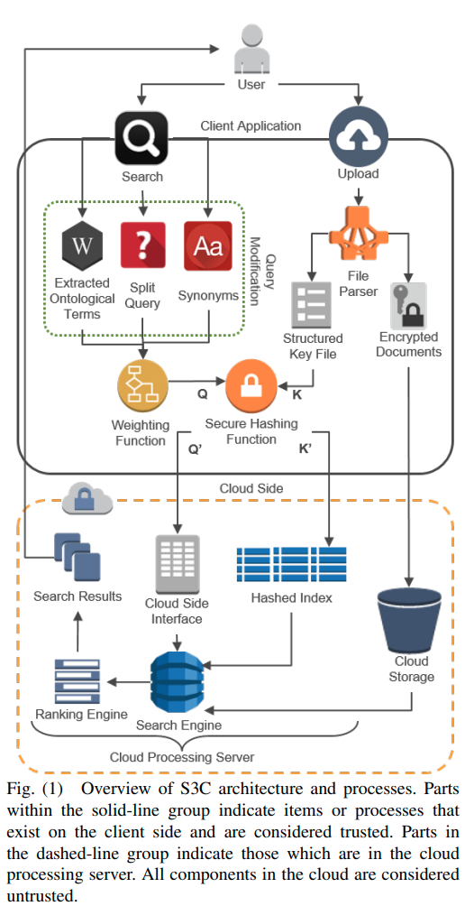

# Secure Semantic Search in the Cloud (S3C)
## Introduction
This is an open-source program that enables semantic enterprise search for unstructured datasets stored in the cloud. 
If you are using this tool in your research projects, please cite the following paper:
```
@inproceedings{woodworth2016s3c,
  title={S3C: An architecture for space-efficient semantic search over encrypted data in the cloud},
  author={Woodworth, Jason and Salehi, Mohsen Amini and Raghavan, Vijay},
  booktitle={Proceedings of the 4th IEEE International Conference on Big Data},
  series={Big Data'16},
  pages={3722--3731},
  year={2016},
  month={December}
}
```
The paper is also available in the following address:
http://hpcclab.org/paperPdf/bigdata16/bigdata16.pdf

## Architecture
<p align="center"></p>

## How to Install and Execute the Project
Below, you can find the steps to execute the program:
1. Clone the repository:
```git clone https://github.com/hpcclab/S3C.git ```
2. Provide full access to the project folder: chmod a+x "/path/to/the/repository/folder/and/its contens. Example:
```chmod a+x /home/S3C/*``` 
3. Execute script ```./exec.sh``` to create folder + unzip demo dataset. 
4. Check 'cloud' folder is created in the parent folder. That means script runs successfully. 
5. Open Eclipse on other Java IDE
6. Import two project:
 	a. Open Project -> Path to S3C -> ```Semantic Search Client```
  b. Open Project -> Path to S3C -> ``` Semantic Search Cloud ```

6.1. If you see an error in the client code, you need to add the "jsoup" jar file. For that purpose, in the project, find "lib" directory, right-click on jsoup-1.8.2.jar in that directory and click on "Build path" and choose "Add to Build Path"

7. Run cloud project -> (Main class: SemanticSearchCloud.java)

8. Run client project -> (Main class: SemanticSearchClient.java)

9. 
   a. Type ```-u``` in client console.
   b. Provide the upload path. Type ```input/demo_dataset```. Our demo dataset is ready to be uploaded. 


10. After uploading, stop client execution. At this time, server has already built index and docSize. 

11. Re-run client project. Type ```-s``` to search over the index.

12. From the result, keep a note of the file (s) that you want to decrypt. 
13. Go to Semantic Search Client -> uploads folder. Copy those files into ``` semantic Search Client -> data-> input_encrypted folder```
14. Re-run Client project. Choose ```-d``` to decrypt resulted document. Insert ```file_name.txt``` 
15. After getting successful message, go to ``` semantic Search Client -> data-> output_decrypted folder```. Open the decrypted file to read the content!!

## How to Contribute
We welcome new features, extension, or enhancements of S3C.

We are, in particular, looking for new collaborations, taking this framework further. As extension of S3C, we have developed S3BD that is similar to S3C but can perform search over encrypted Big Data. In addition to this, we are also researching to extend the capabilities of S3C such as search query expansion, intelligent pruning, clustering, and so on. Please drop us an email if you are interested. 

## Contacts
* [Dr. Mohsen Amini Salehi](http://hpcclab.org/index.php/contact-us/)
* [Jason Woodworth](https://vrlab.cmix.louisiana.edu/people/jason-woodworth/)
* [SM Zobaed](zobaedsakib@gmail.com)


